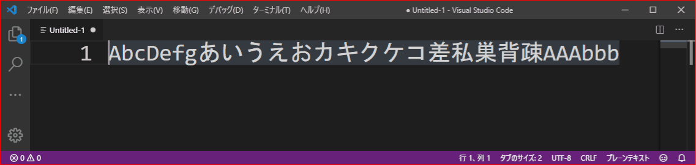
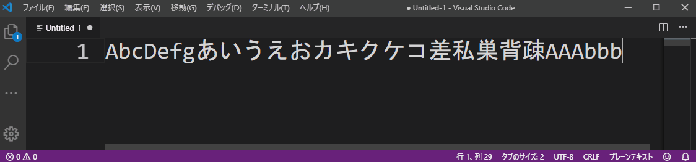
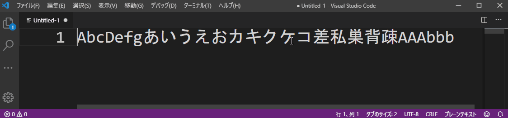

# skr Jp Word Handler
This extension provides "Sakura Editor(サクラエディタ)"-like cursor movement.  
In fact, it incorporates the Sakura Editor-like behavior, plus the cursor movement behavior of `cursorWordPartLeft` and `cursorWordPartRight` in VSCode.

This extension was developed based on Suguru Yamamoto's "Japanese Word Handler" extension.
<https://marketplace.visualstudio.com/items?itemName=sgryjp.japanese-word-handler>


## Install

Install this extension.

## Features

### Cursor Move



- skrJpWordHandler.moveWordPartLeft: Cursor jump by WordType(left)
  - Windows:Ctrl + Left
  - Mac:Command + Left
- skrJpWordHandler.moveWordPartRight: Cursor jump by WordType(right)
  - Windows:Ctrl + right
  - Mac:Command + right


### Cursor Move(Selection)

- skrJpWordHandler.moveWordPartLeftSelect: Cursor jump by WordType(left selection)
  - Windows:Ctrl + Shift + Left
  - Mac:Command + Shift + Left
- skrJpWordHandler.moveWordPartRightSelect: Cursor jump by WordType(right selection)
  - Windows:Ctrl + Shift + Right
  - Mac:Command + Shift + Right

### Delete by WordType

- skrJpWordHandler.deleteWordPartLeft: Delete by WordType(left side from cursor)
  - Windows:Ctrl + Backspace
  - Mac:Command + Backspace
  - 
- skrJpWordHandler.deleteWordPartRight: Delete by WordType(right side from cursor)
  - Windows:Ctrl + Delete
  - Mac:Command + Delete
  - 


### Specified WordType pattern
  - Separation character set in "SeparateWord" of VSCode settings
  - White space
  - Alphabet (upper case)
  - Alphabet (lower case)
  - Number
  - Symbol
  - Tab control code
  - Japanese hiragana
  - Japanese katakana
  - Japanese kanji
  - Japanese punctuation
  - Japanese double-byte alphabetic characters (upper case)
  - Japanese double-byte alphabetic characters (lower case)
  - Japanese double-byte numbers
  - Japanese double-byte symbols

### Precautions of Keyboard assign

Disable the following VSCode standard keyboard assignments because to interfere this extension.  
You can set it immediately by add the following keyboard setting to keybinding.json.

- Windows
```json
    {
        "key": "ctrl+left",
        "command": "-cursorWordStartLeft",
        "when": "textInputFocus",
    },
    {
        "key": "ctrl+shift+left",
        "command": "-cursorWordStartLeftSelect",
        "when": "textInputFocus",
    },
    {
        "key": "ctrl+right",
        "command": "-cursorWordEndRight",
        "when": "textInputFocus",
    },
    {
        "key": "ctrl+shift+right",
        "command": "-cursorWordEndRightSelect",
        "when": "textInputFocus",
    },
    {   "key": "ctrl+backspace",
        "command": "-deleteWordLeft",
        "when": "textInputFocus && !editorReadonly",
    },
    {   "key": "ctrl+delete",
        "command": "-deleteWordRight",
        "when": "textInputFocus && !editorReadonly",
    },
```

- Mac
```json
    {
        "key": "cmd+left",
        "command": "-cursorHome",
        "when": "textInputFocus"
    },
    {
        "key": "shift+cmd+left",
        "command": "-cursorHomeSelect",
        "when": "textInputFocus"
    },
    {
        "key": "cmd+right",
        "command": "-cursorEnd",
        "when": "textInputFocus"
    },
    {
        "key": "shift+cmd+right",
        "command": "-cursorEndSelect",
        "when": "textInputFocus"
    },
    {
        "key": "cmd+backspace",
        "command": "-deleteAllLeft",
        "when": "textInputFocus && !editorReadonly"
    },
    {
        "key": "cmd+delete",
        "command": "-deleteAllRight",
        "when": "textInputFocus && !editorReadonly"
    },
```

## Known limitations

As with the "Japanese Word Handler" extension, there are some limitations.  
The extension function cannot replace the following functions related to words.
  - Word selection by double-click.
  - Automatic highlighting of words on the cursor position.
  - "Hit word" when searching text.

## License
This extension was developed based on Suguru Yamamoto's "Japanese Word Handler" extension.
<https://marketplace.visualstudio.com/items?itemName=sgryjp.japanese-word-handler>

zlib

----

# skr Jp Word Handler(日本語)

Windowsのサクラエディタライクなカーソル移動を行います。
実際には、サクラエディタっぽい挙動に加えて、VSCodeのcursolWordPartLeftとcursolWordPartRightのカーソル移動の挙動も取り入れています。

本拡張機能は、Suguru Yamamoto氏のJapanese Word Handler拡張機能をベースに開発されました。
<https://marketplace.visualstudio.com/items?itemName=sgryjp.japanese-word-handler>


## 導入方法

本拡張機能をインストールしてください。

## 実装機能

### カーソル移動


- skrJpWordHandler.moveWordPartLeft: 区切り文字毎ジャンプ左カーソル
  - Windows:Ctrl + Left
  - Mac:Command + Left
- skrJpWordHandler.moveWordPartRight: 区切り文字毎ジャンプ右カーソル
  - Windows:Ctrl + right
  - Mac:Command + right


### カーソル移動（選択）
- skrJpWordHandler.moveWordPartLeftSelect: 区切り文字毎ジャンプ左カーソル（選択）
  - Windows:Ctrl + Shift + Left
  - Mac:Command + Shift + Left
- skrJpWordHandler.moveWordPartRightSelect: 区切り文字毎ジャンプ右カーソル（選択）
  - Windows:Ctrl + Shift + Right
  - Mac:Command + Shift + Right

### 句切り文字毎削除
- skrJpWordHandler.deleteWordPartLeft: 区切り文字毎削除（カーソルより左側）
  - Windows:Ctrl + Backspace
  - Mac:Command + Backspace
  - 
- skrJpWordHandler.deleteWordPartRight: 区切り文字毎削除（カーソルより右側）
  - Windows:Ctrl + Delete
  - Mac:Command + Delete
  - 


### 対応句切文字パターン
  - VSCodeのSeparateWordに設定する区切り文字
  - スペース
  - 英字(大文字)
  - 英字(小文字)
  - 数字文字
  - 記号
  - タブ制御コード
  - 日本語のひらがな
  - 日本語のカタカナ
  - 日本語の漢字
  - 日本語の句読点
  - 日本語の全角英字(大文字)
  - 日本語の全角英字(小文字)
  - 日本語の全角数字
  - 日本語の全角記号

### キーボードアサインの注意

次のVSCode標準のキーボード操作と干渉するため、無効にしてください。
下記のキーボード設定をkeybinding.jsonに追記すると、すぐに設定できます。

- Windows
```json
    {
        "key": "ctrl+left",
        "command": "-cursorWordStartLeft",
        "when": "textInputFocus",
    },
    {
        "key": "ctrl+shift+left",
        "command": "-cursorWordStartLeftSelect",
        "when": "textInputFocus",
    },
    {
        "key": "ctrl+right",
        "command": "-cursorWordEndRight",
        "when": "textInputFocus",
    },
    {
        "key": "ctrl+shift+right",
        "command": "-cursorWordEndRightSelect",
        "when": "textInputFocus",
    },
    {   "key": "ctrl+backspace",
        "command": "-deleteWordLeft",
        "when": "textInputFocus && !editorReadonly",
    },
    {   "key": "ctrl+delete",
        "command": "-deleteWordRight",
        "when": "textInputFocus && !editorReadonly",
    },
```

- Mac
```json
    {
        "key": "cmd+left",
        "command": "-cursorHome",
        "when": "textInputFocus"
    },
    {
        "key": "shift+cmd+left",
        "command": "-cursorHomeSelect",
        "when": "textInputFocus"
    },
    {
        "key": "cmd+right",
        "command": "-cursorEnd",
        "when": "textInputFocus"
    },
    {
        "key": "shift+cmd+right",
        "command": "-cursorEndSelect",
        "when": "textInputFocus"
    },
    {
        "key": "cmd+backspace",
        "command": "-deleteAllLeft",
        "when": "textInputFocus && !editorReadonly"
    },
    {
        "key": "cmd+delete",
        "command": "-deleteAllRight",
        "when": "textInputFocus && !editorReadonly"
    },
```

## 既知の制限事項
JapaneseWordHandler拡張機能と同様に一部制限があります。  
拡張機能は、単語に関する以下の機能を差し替えることができません。
- ダブルクリックによる単語選択
- カーソルポジション上の単語の自動ハイライト
- テキスト検索時の「単語にヒット」

## ライセンス
本拡張機能は、Suguru Yamamoto氏のJapanese Word Handler拡張機能をベースに開発されました。
<https://marketplace.visualstudio.com/items?itemName=sgryjp.japanese-word-handler>

zlib
